# SwasthAI: AI-Powered Premium Healthcare Operating System 🩺🇮🇳

SwasthAI is a production-ready, full-stack premium healthcare platform designed to solve India's fragmented medical dispatch and resource routing problems. Built with an Apple Vision Pro-inspired glassmorphism interface, interactive 3D particle backgrounds, and real-time data sync, it provides instant access to proximity-sorted hospitals, blood bank lookups, generic medicine savings, and emergency SOS services.

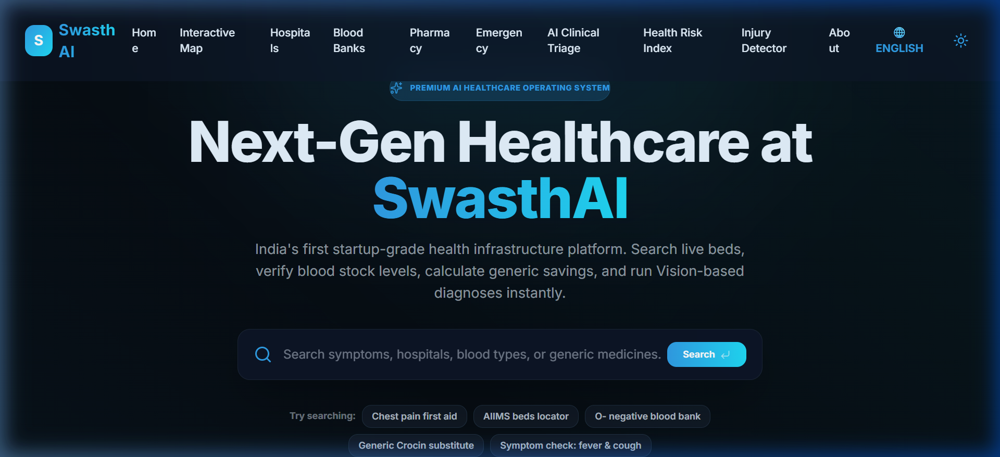

---

## 🚨 The Real-World Problem

Emergency healthcare coordination in India is highly fragmented, leading to critical delays and high costs:
1. **Critical SOS Ambiguity**: In emergencies, victims or bystanders lack a simple, unified interface to trigger geo-located distress alerts and locate the closest matching trauma facilities.
2. **Hidden Blood Stock Levels**: Patients and families frequently search blindly for blood bank units during critical surgeries due to a lack of live, searchable stock directories.
3. **Overpriced Brand-Name Medicines**: Essential branded medicines are heavily marked up. Many citizens are unaware of identical, affordable generic alternatives (e.g. Jan Aushadhi generic equivalents).
4. **Delayed Clinical Assessment**: Hospital emergency rooms suffer from congestion because patients lack access to quick, preliminary AI-driven symptom sorting (triage) to guide them to the right specialist.

---

## 💡 How SwasthAI Solves This (Features & Visual Walkthrough)

SwasthAI acts as a centralized, high-fidelity healthcare dashboard:

### 1. Interactive 3D Hero Landing Page
Featuring a WebGL-based **React Three Fiber interactive DNA Double Helix** and background space-dust particles. Moving the cursor tilts and rotates the helix in real-time (parallax depth effect), styled to keep headings and the global search engine perfectly readable.


### 2. Proximity-Sorted Hospital Bed Finder
Utilizes the **Haversine formula** to calculate distance between user coordinates and seeded medical institutions, sorting AIIMS, Government, Private, and Trauma centers by proximity and displaying bed availability.

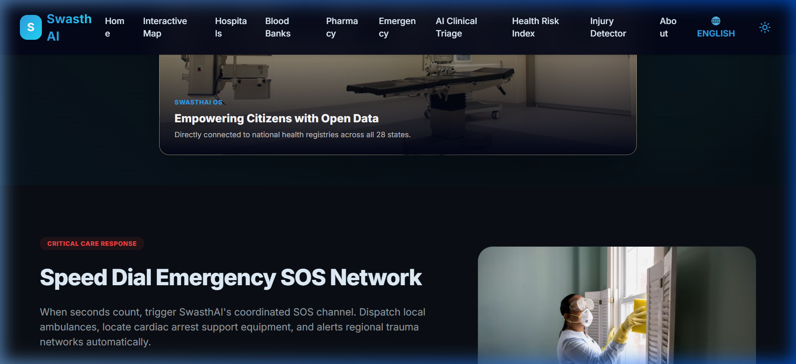

### 3. Live Blood Stock Inventory Lookup
Searchable directory by state, city, and blood type showing detailed unit levels (A+, O-, AB+, etc.) to find matching units instantly.

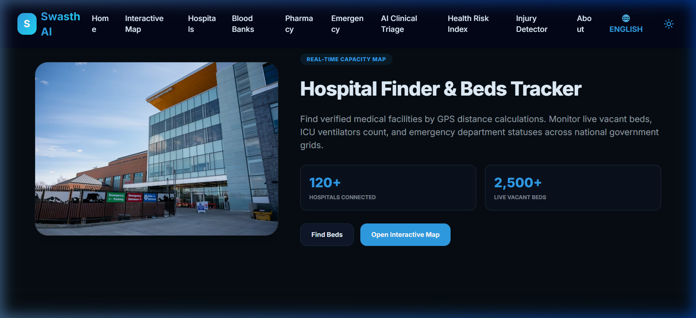

### 4. Branded vs. Generic Jan Aushadhi Savings Calculator
Calculates and visualizes savings (often 75%+ cost reduction) by matching branded search terms against exact generic medicine equivalents.

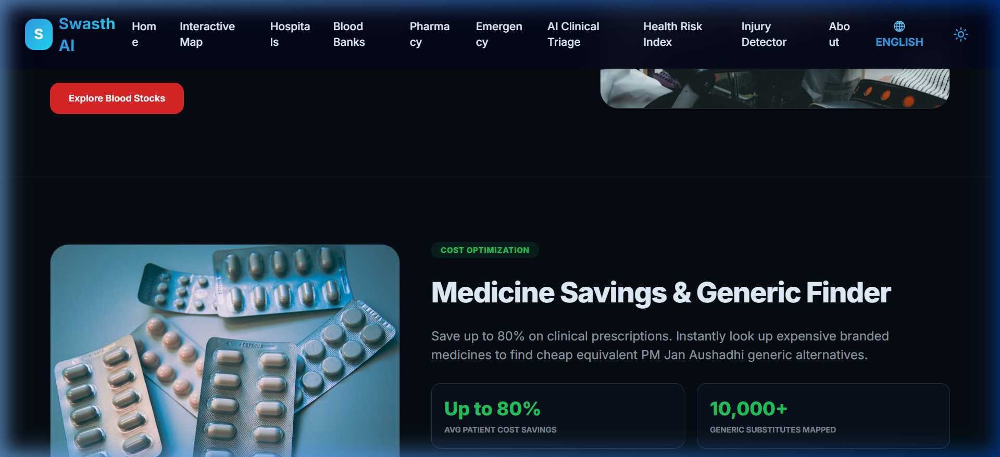

### 5. AI Triage Command Center
An interactive symptom analyzer styled like premium search menus. Categorizes symptom severity (Critical, Moderate, Mild), highlights possible diagnoses, and recommends immediate actionable medical paths.

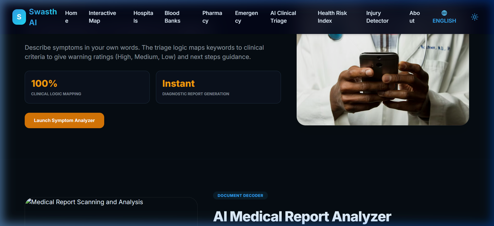

### 6. One-Click SOS Panic System
Triggers a 5-second countdown to prevent accidental activations, acquires live GPS coordinates, logs the emergency, and instantly routes first-aid steps along with the nearest trauma hospital coordinates.

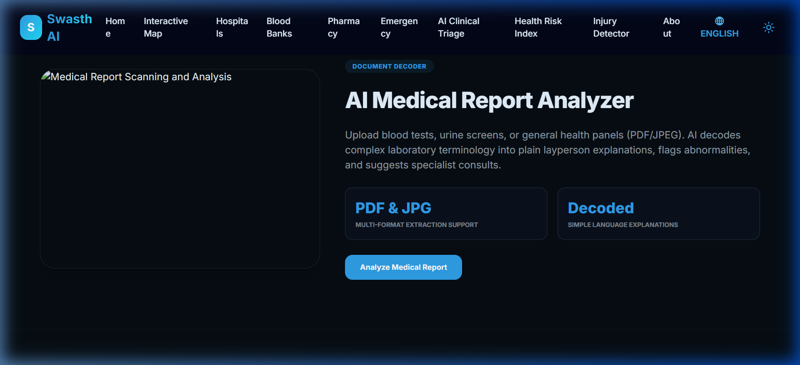

### 7. Interactive GIS Map with Route Suggestion Vectors
Renders a live Leaflet-powered GIS map pinning nearest hospitals, blood banks, and pharmacies, calculating nearest target paths, and drawing route vectors.

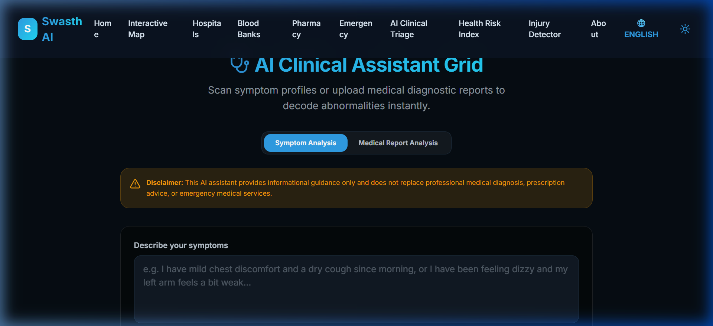

### 8. Lifestyle Risk Prediction Center
Processes patient metrics (Age, BP, BMI, habits, family history) to output risk probabilities for Heart Disease, Stroke, and Diabetes alongside dynamic circular progress metrics.

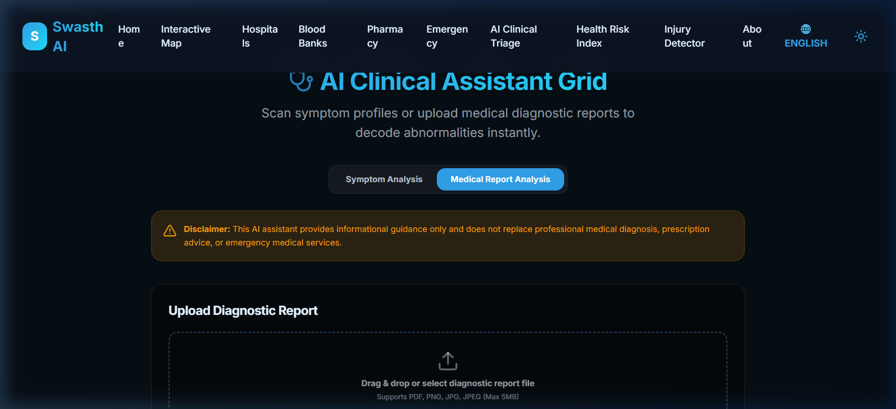

### 9. Vision-Based Wound Scanner & Injury Detector
Processes images of cuts, burns, fractures, skin infections, bruises, and swelling using Gemini Vision / local keyword matching to output severity level confidence metrics.

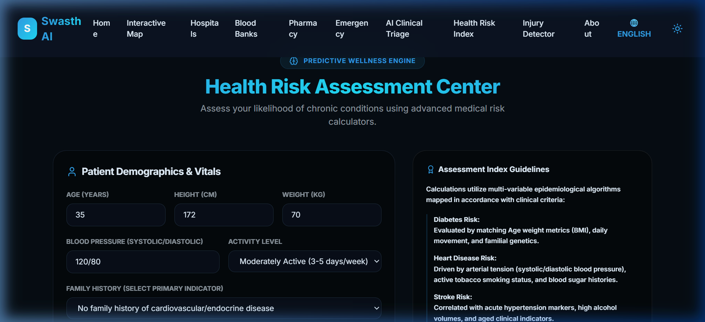

### 10. AI Medical Report Decoder
Accepts PDF/JPG laboratory panel files and translates complex medical markers into simple, layperson explanations with specialist recommendations.

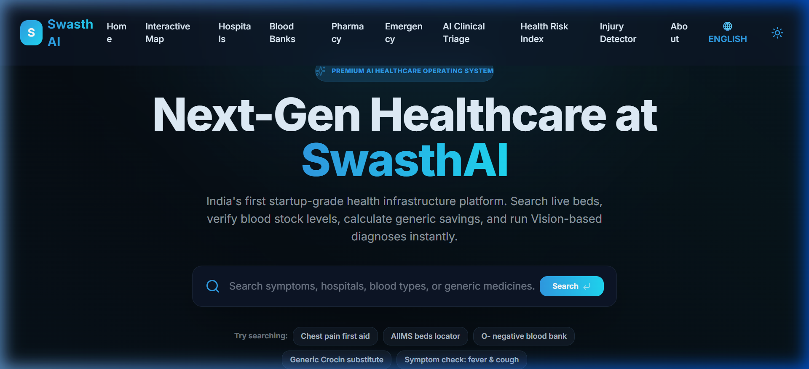

### 11. National Health Registry Analytics
Dynamic charts (using Recharts) representing state-wise beds and blood inventories synchronized live with the backend database.

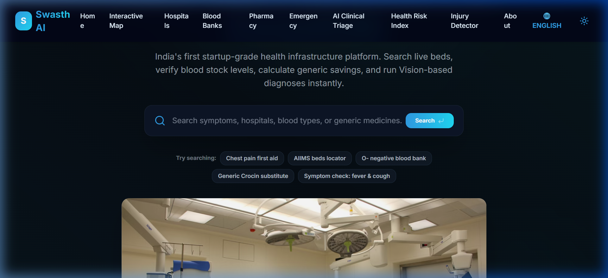

---

## 🛠️ The Tech Stack

* **Frontend**: React 18, React Router 6 (SPA mode), TypeScript, TailwindCSS 3, Lucide React icons, Framer Motion (premium animations), React Three Fiber (3D engine).
* **Backend**: Express.js server, Node.js.
* **ORM & Database**: Prisma v6 client, PostgreSQL (Supabase backend session port 5432).
* **Internationalization**: Localized context dictionary supporting **10 Indian languages** (English, हिन्दी, தமிழ், తెలుగు, বাংলা, मराठी, ગુજરાતી, ਕੰਨੜ, മലയാളം, ਪੰਜਾਬੀ).
* **Styling**: Curated HSL color palette, customized dark/light theme options, and premium glassmorphism layouts.

---

## 🚀 Getting Started

### 1. Prerequisites
Ensure you have [Node.js](https://nodejs.org/) (v18+) and [PNPM](https://pnpm.io/) installed.

### 2. Installation
```bash
# Clone the repository
git clone https://github.com/Manvi0408/SwasthAII.git
cd SwasthAII

# Install dependencies
pnpm install
```

### 3. Database Initialization & Seeding
Ensure you copy `.env.example` to `.env` and fill in your connection details (PostgreSQL port 5432 string):
```bash
# Generate the Prisma client
npx prisma generate

# Push database schema to Supabase/PostgreSQL
npx prisma db push

# Seed resources
npx tsx server/prisma/seed.ts
```

### 4. Running the Dev Server
Start the client + backend API server on a single port (`8080`):
```bash
# Start Vite and Express server concurrently
pnpm dev
```
Open [http://localhost:8080](http://localhost:8080) in your browser.

---

## 🌍 Production Deployment

### Vercel (Instant Setup)
The project is pre-configured for Vercel deployment via `vercel.json` and a serverless backend adapter.

1. Connect your GitHub repository to [Vercel](https://vercel.com).
2. Set the build directory to standard defaults (it runs `pnpm build` and serves static files from `dist/spa`).
3. Set up a cloud database (like **Supabase** or **Neon.tech**) and add your database URL under **DATABASE_URL** and **GEMINI_API_KEY** in Vercel's Environment Variables.
4. Vercel automatically deploys the backend server under `/api/*` via the [api/index.ts](file:///c:/Users/Manvi/Downloads/swasthai-healthcare-platform-7b2/api/index.ts) Node function.
